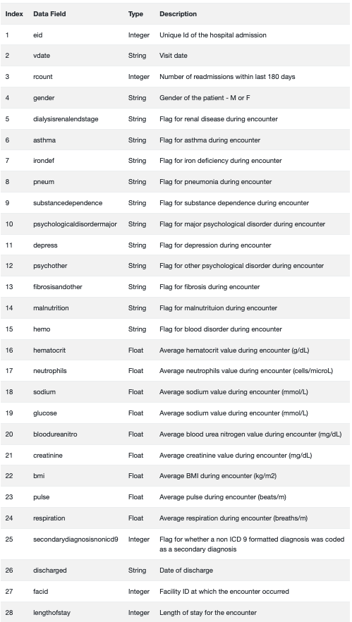

# LOS-in-hospital

## Objectif : Prédire la durée de séjour dans les hôpitaux.

Le but de ce projet est d’offrir une durée de séjour prévue pour chaque patient (LOS - Length of stay) au moment de leur admission à l'hôpital.
Les entrées du modèle de prédiction comprendront des caractéristique comme les diagnostics du patient (maladie cardiaque, analyses sanguine, …), sex, etc

### 1.1 Énoncé du problème

Le but de ce projet est de créer un modèle qui prédit la durée de séjour de chaque patient au moment de l'admission. Ma première intuition était que les entrées du modèle de prédiction devraient idéalement inclure des caractéristiques telles que la catégorie de diagnostic du patient (par exemple, maladie cardiaque, accouchement, blessure / empoisonnement, etc.), le sexe. L'âge des patients est inconnu.

### 1.2 Description et analyse des données

Le jeux de données utilisé et celui du https://microsoft.github.io/r-server-hospital-length-of-stay/input_data.html 

      

### 1.3 Métriques d'évaluation

Le résultat attendu de ce projet est de développer un modèle qui sera plus efficace pour prédire la durée de vie des hôpitaux que les normes de l'industrie en matière de durée de vie médiane et moyenne. La DS médiane est simplement la DS médiane des admissions passées dans un hôpital. 
De même, une deuxième métrique couramment utilisée dans les soins de santé est la moyenne ou la durée de vie moyenne.

Le RMSE est une mesure couramment utilisée des différences entre les valeurs prédites par un modèle et les valeurs observées, où un score inférieur implique une meilleure précision. Un modèle de prédiction parfait aurait un RMSE égal à 0.
